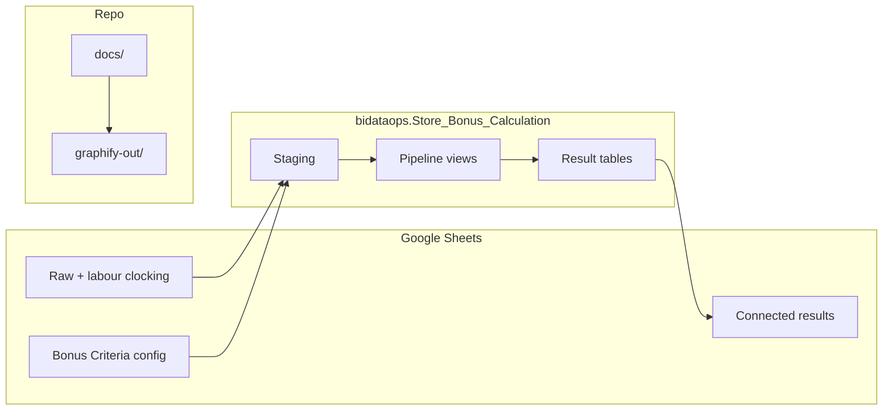

# Bonus Calc Redesign — Master Plan

> **Location:** [.cursor/plans/bonus_calc_redesign.plan.md](bonus_calc_redesign.plan.md) (this file)  
> **Detailed specs:** [docs/README.md](../../docs/README.md) → design, schemas, sheets-integration, decisions-log

---

## Decisions (confirmed)

| Topic | Choice |
|-------|--------|
| Compute | **BigQuery** — `bidataops.Store_Bonus_Calculation` (**US**) |
| UI | **Google Sheets** — [Espy 2026-06 V2](https://docs.google.com/spreadsheets/d/19do6Op70r7OkvS0u9EsyXkicxI0WzzQW3gvKOgJJbi4) (config, raw, labour, results) |
| Glue | **External tables** (Sheets → BQ) + **Connected Sheets** (BQ → results) + optional Apps Script to **trigger** pipeline |
| Scope | **Single `cycle_month` per run**; manual Sheet backup; no partitioning/history yet |
| Corrections tab | **Out of scope** |
| Overrider | From **`cfg_overrider_tier`** only (sales/target brackets) |
| Fact table | **Labour clocking** — employee × store × position per month |
| Proration | `%OfPrimaryJobDays` + `ActualHours` (exact formula TBD on examples) |
| Cluster managers | Home store bonus + managed-store amounts from Cluster Manager tab; rows at bottom of Calculation output |
| Angola | Early run excludes Angola (~before 10th); late run includes via `@exclude_countries` / `@include_countries` |
| policy_key | Stamped on Store Master; sparse KPI weights (missing = N/A) |
| Dev tooling | **Graphify** — `graphify-out/` + `.cursor/rules/graphify.mdc` |
| Python engine | **Retired** |

---

## Architecture

---

## Config layer (`policy_key`)

Wide **Bonus Criteria** sheet in Google Sheets → sync unpivots to BigQuery:

- `cfg_policy_key` — Key, country, brand, delivery, shrink limits, minimum bonus
- `cfg_manager_kpi_weight` — one row per (policy_key, kpi_code, weight); absent = N/A
- `cfg_store_bonus_weight` — GUARANTEED / OIL_SHRINK / SHRINK_EX_OIL
- `cfg_position_bonus_potential` — Branch / Assistant / Junior / Cluster Manager amounts
- `cfg_overrider_tier` — 105/110/115/120/+120 brackets
- `cfg_global_parameter` — attendance gate, pool %, cluster share, floor
- `dim_store` — Store Master with stamped `policy_key`

---

## Pipeline order

1. **Eligibility** — qualifying stores (open dates, country filter)
2. **KPI gates** — PASS/FAIL/NA per store per KPI
3. **Store sales** — actual vs target, achievement ratio
4. **Manager bonus %** — sum(weights × PASS) + penalties (parallel with 5)
5. **Store bonus pool** — 10% over target × weighting ÷ headcount
6. **Overrider** — tier lookup from config on achievement ratio
7. **Cluster manager** — 30% share per managed store
8. **Enrich labour clocking lines** — store bonus + manager + overrider per line
9. **Calculation detail** — unpivot KPI audit rows
10. **Payout per person** — aggregate + attendance/termination/AWOL gates

---

## Four outputs

| Table | Grain |
|-------|-------|
| `rpt_calculation_table` | employee × store × position × KPI line (+ cluster rows at bottom) |
| `rpt_payout_per_person` | employee |
| `rpt_store_bonus_summary` | store |
| `rpt_manager_bonus_summary` | store (manager entry) |

---

## Implementation phases

### Phase 1 — Foundation (next)
- [ ] Create BigQuery dataset `bidataops.Store_Bonus_Calculation`
- [ ] **Share workbook** with BigQuery access identity (Viewer)
- [ ] Run **external tables** — [sql/00_ddl/ext_sheets/](../../sql/00_ddl/ext_sheets/) (workbook URL wired)
- [ ] Confirm tab names match SQL (`Managers criteria`, `Store master`, …)
- [ ] Add **labour clocking** Sheet URL to `ext_labour_clocking.sql` — **done** (V2 `Labour_Data`)
- [ ] Views: unpivot `ext_bonus_criteria` → `cfg_*`; cast `ext_labour_clocking` → `v_stg_labour_clocking`
- [ ] Native `rpt_*` tables for pipeline outputs

### Phase 2 — Pipeline (non-Angola)
- [ ] `sql/01_views/` — steps 1–10
- [ ] `sql/02_pipeline/run_bonus_calc.sql` with `@cycle_month`, `@exclude_countries`

### Phase 3 — Sheets integration
- [ ] Connected Sheets → four result tabs (`rpt_*`)
- [ ] Optional Apps Script: **Run pipeline** button (scheduled query), refresh Connected Sheets
- [ ] ~~Apps Script copy every tab~~ — **not needed** if external tables cover inputs

### Phase 4 — Validation & Angola
- [ ] 2–3 regression examples
- [ ] Resolve open items in [docs/decisions-log.md](../../docs/decisions-log.md)
- [ ] Angola late run

---

## Open questions (during build)

- [ ] Exact `work_share` formula (`%OfPrimaryJobDays` + `ActualHours`)
- [ ] Headcount source — Employees info vs labour clocking
- [ ] Lesotho keys (`HL_LES_*` vs RSA)
- [ ] Overrider zero for Zimbabwe & Mauritius
- [ ] Floor of 50 — aggregation only?

---

## Completed / obsolete

- ~~Python `bonus_engine/` scaffold~~ — removed
- ~~Platform choice doc (BigQuery vs Apps Script)~~ — BigQuery chosen; see [docs/design.md](../../docs/design.md)
- ~~Old plan~~ [bonus_engine_scaffold_39fba3b1.plan.md](bonus_engine_scaffold_39fba3b1.plan.md) — superseded by this file

---

## Related files

| File | Purpose |
|------|---------|
| [docs/README.md](../../docs/README.md) | Handoff entry point |
| [docs/design.md](../../docs/design.md) | Architecture |
| [docs/schemas-and-pipeline.md](../../docs/schemas-and-pipeline.md) | Table schemas + step detail |
| [docs/sheets-integration.md](../../docs/sheets-integration.md) | Sheet ↔ BQ mapping |
| [docs/decisions-log.md](../../docs/decisions-log.md) | Confirmed decisions |
| [docs/graphify.md](../../docs/graphify.md) | Knowledge graph usage |
| [graphify-out/GRAPH_REPORT.md](../../graphify-out/GRAPH_REPORT.md) | Auto-generated architecture summary |
