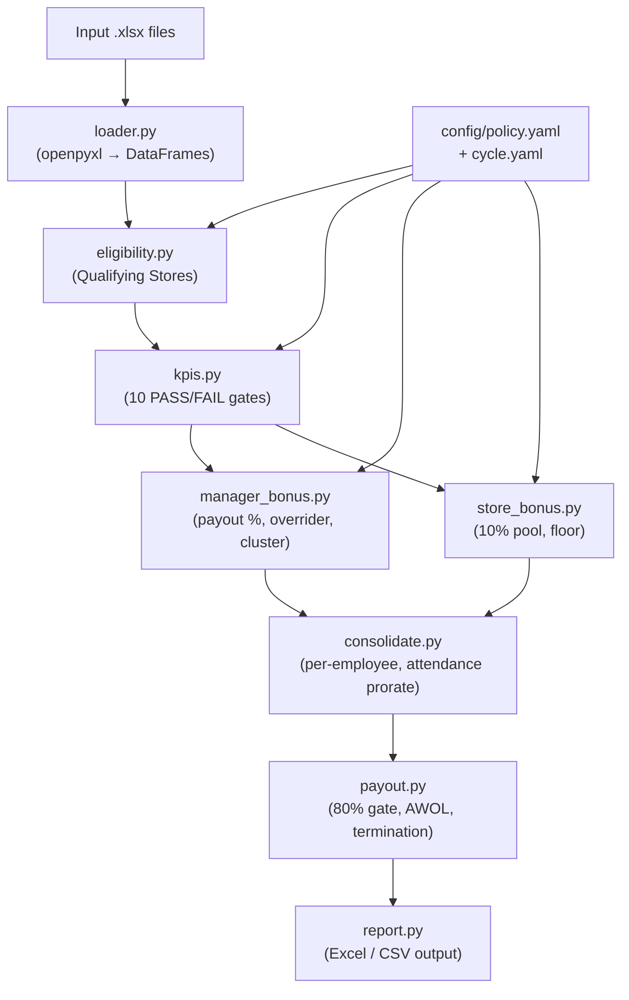

# Bonus Engine Scaffold

## What gets built

```
Gideon-Bonus/
├── config/
│   ├── policy.yaml        # all tunable rules (weights, tiers, thresholds, floors)
│   └── cycle.yaml         # per-run inputs (month, FX rates, exception lists)
├── bonus_engine/
│   ├── __init__.py
│   ├── loader.py          # reads .xlsx inputs into pandas DataFrames
│   ├── eligibility.py     # Qualifying Stores logic
│   ├── kpis.py            # all 10 KPI gates → PASS/FAIL per store
│   ├── manager_bonus.py   # payout % × monthly potential + overrider + cluster share
│   ├── store_bonus.py     # 10% pool, shrink gate, per-person split, floor
│   ├── consolidate.py     # per-employee: prorate by attendance, apply penalties
│   ├── payout.py          # 80% gate, timecard/AWOL loss, termination rules
│   └── report.py          # write PAYOUT PER PERSON + comms text to Excel/CSV
├── tests/
│   └── test_regression.py # diff engine output vs current sheet's known values
├── run.py                  # CLI entry point
└── requirements.txt        # openpyxl, pandas, pyyaml
```

## Architecture



## Key decisions

- **pandas** for all computation (replaces the copied ARRAYFORMULA rows — one vectorised operation per rule).
- **`config/policy.yaml`** pre-filled with every value extracted: KPI weights by country/store-type, monthly bonus amounts by position × country, overrider tiers, store-bonus weightings, oil thresholds, attendance gate (80%), per-person floor (50), cluster share (30%).
- **`config/cycle.yaml`** holds the month (`2026-05`), exchange rates (from `Exchange info`), and the two date cutoffs from `Qualifying Stores`.
- **`loader.py`** reads both `.xlsx` exports directly — no manual CSV conversion needed.
- **`tests/test_regression.py`** loads the `PAYOUT PER PERSON` tab from the Audit xlsx as ground-truth and asserts the engine matches within a tolerance, so we can prove correctness before trusting the new system.
- The analysis scripts (`_inspect.py`, `_read_audit.py`, etc.) stay as-is; they are not part of the engine.
- The `.venv` already has `openpyxl`. `pandas` and `pyyaml` will be added to `requirements.txt` and installed.

## Files changed / created

- `config/policy.yaml` — new
- `config/cycle.yaml` — new
- `bonus_engine/__init__.py` — new (empty)
- `bonus_engine/loader.py` — new
- `bonus_engine/eligibility.py` — new
- `bonus_engine/kpis.py` — new
- `bonus_engine/manager_bonus.py` — new
- `bonus_engine/store_bonus.py` — new
- `bonus_engine/consolidate.py` — new
- `bonus_engine/payout.py` — new
- `bonus_engine/report.py` — new
- `tests/test_regression.py` — new
- `run.py` — new
- `requirements.txt` — new
- `.gitignore` — updated (add `inputs/`, `*.xlsx` raw data, `__pycache__`)

No existing files are modified.
