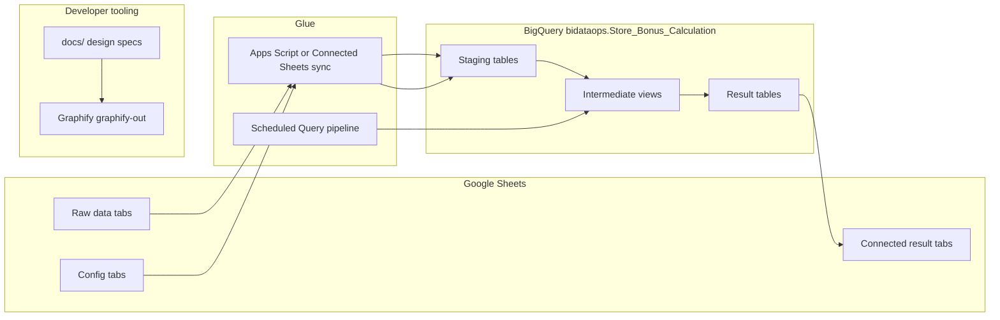

# Architecture & Design Decisions

## Platform

| Layer | Technology | Role |
|-------|------------|------|
| Compute & storage | **BigQuery** | All joins, KPI gates, bonus math, intermediate and result tables |
| Human UI | **Google Sheets** | Edit config, paste raw data, view results via Connected Sheets |
| Glue | **Light Apps Script** + **Scheduled Queries** | Sync Sheet ranges → BigQuery; trigger pipeline; optional refresh button |

Sheets **must not** contain live calculation formulas for the bonus engine. Formulas caused the 10M-cell limit and lag. Sheets only hold inputs, config, and read-only result views.

### Why BigQuery (not Apps Script for compute)

- Many-to-many joins (employee × store × position × KPI × policy_key).
- ~10k+ assignment lines per month with full audit detail.
- SQL is easier to review, test on one store, and hand off than a large Apps Script file.
- You already have GCP/BigQuery access.

Apps Script remains useful for: menu button “Run bonus calc”, pushing a Sheet tab to a staging table, refreshing Connected Sheets.

---

## Scope per run: single month only

Each pipeline run is scoped to **one `cycle_month`** (e.g. `2026-05`).

- Staging and result tables are **replaced or truncated for that month** before each run (no historical partitions yet).
- You manually download the Google Sheet after each run as your backup (config + results together).
- When policy changes, edit config in Sheets and re-run the same month.

**Future (not now):** partition by `cycle_month`, keep prior runs in BigQuery for trending.

---

## Data spine: labour clocking

The **labour clocking** file (shared Google Sheet) is the base fact table:

**Grain:** one row per **employee × store × position** for the selected month.

Typical fields (names may vary — confirm against your file):

- Employee id, name, employment status
- Store, position (job)
- Hours worked / days worked / attendance metrics
- Hire date, termination reason (if applicable)
- AWOL / absent flags

**Pipeline flow:**

```
labour_clocking (lines)
    → enrich with store policy_key, country, KPI results, store bonus pool, manager rates
    → rpt_calculation_line (one row per line with full criteria/metric/score/outcome detail)
    → aggregate by employee
    → rpt_payout_per_person
```

Cluster managers are **not** in the main labour clocking roll-up the same way: they appear at the **bottom** of the Calculation output with:

1. **Home store** — normal manager bonus path for their home store/position.
2. **Managed stores** — additional amounts from the **Cluster Manager** config/assignment tab (30% share of manager bonus % × potential per managed store, plus managed-store overrider share per existing rules).

---

## Outputs (four required)

| Output | Grain | Purpose |
|--------|-------|---------|
| **Calculation table** | employee × store × position × KPI line (detail) | Audit trail: criteria, metric, target, pass/fail, weight, amount |
| **Payout per person** | employee | Sum of line contributions + cluster rows; final gates applied |
| **Store bonus summary** | store | Pool, qualification, headcount, per-person share |
| **Manager bonus summary** | store (manager entry) | KPI breakdown, payout %, overrider, amounts |

**Excluded:** Corrections tab — manual reconciliation outside this system.

---

## Config model: `policy_key`

Your wide **Managers criteria** / **Bonus Criteria** sheet uses keys like `HL_RSA_D`, `HL_RSA_N`, `HL_ANG_N`.

Each store gets a **`policy_key`** on the Store Master (recommended: **stamped manually** with a suggested default from country + brand + delivery flag).

### Sparse / missing criteria

Not every KPI applies to every `policy_key` (e.g. Eswatini has no CoPilot column, Angola has different KPI set, Mauritius/Zimbabwe have no Cluster Manager column in your CSV).

**Recommendation:** store config in **long/narrow** tables:

- If `(policy_key, kpi_code)` has **no row** → KPI is **not applicable** (treated as N/A, weight 0, does not appear in comms as FAIL).
- If row exists with `weight > 0` → KPI applies; evaluate PASS/FAIL and add weight when passed.
- Penalty KPIs (Blocked Drains, Drop Validation) use separate flags on `cfg_policy_key` or dedicated impact columns.

Do **not** require every column populated in a wide sheet for every country. The Sheet can stay wide for editing; sync SQL **unpivots** into `cfg_manager_kpi_weight` on load.

---

## Store bonus vs manager bonus

Computed **in parallel** at store level (neither depends on the other):

| | Store bonus | Manager bonus |
|---|-------------|---------------|
| Base | 10% × (actual sales − target) | Monthly position potential × KPI payout % |
| Main gate | Sales target + shrink-ex-oil (country rules) | Sum of passed KPI weights |
| Split | ÷ qualifying headcount → per-person share | Per manager position at store |
| Overrider | N/A | Flat amount from **config bracket** on `actual_sales / sales_target` |

**Overrider** comes only from `cfg_overrider_tier` (your Overrider 105/110/115/120/+120 columns). No hardcoded tiers in SQL.

---

## Angola: late-cycle run

Angola data often arrives later. Support two run modes via pipeline parameter `@include_countries` / `@exclude_countries`:

1. **Early run (by ~10th):** all countries **except** Angola.
2. **Late run (end of month):** include Angola, or run Angola-only and merge results in Sheets.

Implementation: filter stores by `country` in eligibility and downstream views; same SQL, different parameter. No separate codebase.

---

## Final employee gates (after line aggregation)

Applied at **per-person** level (after summing assignment lines):

- Attendance gate (e.g. ≥ 80% — from `cfg_global_parameter`)
- Termination reasons that zero payout (Misconduct, Discharged, Absconded)
- Timecard exception penalty %
- AWOL / absent → lose all (100% penalty)
- Minimum payout floor (e.g. 50) where current rules apply

Exact rules should be validated against [bonus-model-logic.md](bonus-model-logic.md) §9 during SQL implementation.

---

## Build approach: intricacies now vs later

**You do not need to explain every edge case upfront.**

Recommended approach:

1. **Now:** confirm labour clocking columns, Store Master → `policy_key` mapping, and 2–3 **known-good examples** (one store staff, one branch manager, one cluster manager).
2. **Build:** non-Angola pipeline end-to-end with Calculation detail + Payout per person.
3. **Iterate:** fix country-specific branches as mismatches appear; document each fix in `schemas-and-pipeline.md` or a short `docs/decisions-log.md` entry.

Ambiguities are captured in [schemas-and-pipeline.md](schemas-and-pipeline.md#open-decisions) rather than guessed in SQL.

---

## Diagram



**Graphify** (see [graphify.md](graphify.md)) indexes docs/SQL/Apps Script in this repo so maintainers and AI assistants can query project structure. It does not replace BigQuery for bonus calculation.
