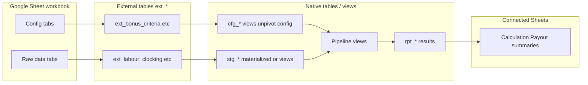

# Google Sheets external tables (BigQuery inputs)

BigQuery **Google Drive external tables** let the pipeline read Sheet tabs directly — no copy step for config. You still need **Connected Sheets** (or export) for **results** back to the UI.

## Two directions

| Direction | Mechanism | Purpose |
|-----------|-----------|---------|
| **Sheets → BigQuery** | `CREATE EXTERNAL TABLE` (format `GOOGLE_SHEETS`) | Config + raw monthly data |
| **BigQuery → Sheets** | **Connected Sheets** | Four result tabs (read-only) |

Apps Script is optional glue: run pipeline button, refresh Connected Sheets, trigger scheduled query — **not** required to copy every tab if external tables are set up.

---

## Recommended hybrid



| Data type | Pattern | Why |
|-----------|---------|-----|
| **Config** (Bonus Criteria, Parameters, Store Master, Cluster Manager, Cycle) | **External table** per tab (named range) | Edits in Sheet are visible on next query; no reload script |
| **Raw monthly** (labour clocking, sales, KPI feeds) | **External table** *or* native `stg_*` load | External = simpler; native = faster joins + strict types for 10k+ rows |
| **Pipeline outputs** | **Native** `rpt_*` tables | Connected Sheets reads these |

For v1: use **external tables for all Sheet inputs**, with **views** that cast types and unpivot wide config. If labour clocking queries are slow, add a scheduled query that `CREATE OR REPLACE TABLE stg_labour_clocking AS SELECT ... FROM ext_labour_clocking` before the main pipeline.

---

## Prerequisites

1. **Google Sheet URL** for the bonus workbook (and labour clocking if separate).
2. **Named ranges** on each tab (stable headers, no merged cells in header row).
3. **BigQuery service account or user** with **Viewer** access on the Sheet:
   - Share the Sheet with the BigQuery connection identity, or
   - Use a service account email from your GCP project.
4. Dataset: `bidataops.Store_Bonus_Calculation`.

---

## External table naming

| Sheet tab | External table | Sheet range (example) |
|-----------|----------------|------------------------|
| Cycle | `ext_cycle` | `Cycle!A:F` |
| Exchange Info | `ext_exchange_rate` | `Exchange Info!A:C` |
| Bonus Criteria | `ext_bonus_criteria` | `Bonus Criteria!A:AB` |
| Store Master | `ext_store_master` | `Store Master!A:Z` |
| Parameters | `ext_parameters` | `Parameters!A:B` |
| Cluster Manager | `ext_cluster_manager` | `Cluster Manager!A:E` |
| Labour Clocking | `ext_labour_clocking` | `Labour Clocking!A:M` |
| Sales | `ext_sales` | `Sales!A:H` |
| … | `ext_*` | one table per raw KPI tab |

See [sql/00_ddl/ext_sheets/](../sql/00_ddl/ext_sheets/) for DDL templates.

---

## Example DDL

Replace `SHEET_URL` and ranges with your workbook. Schema must match the Sheet columns (all STRING is OK initially; cast in views).

```sql
CREATE OR REPLACE EXTERNAL TABLE `bidataops.Store_Bonus_Calculation.ext_bonus_criteria`
(
  Key STRING,
  Detail STRING,
  Country STRING,
  Brand STRING,
  Delivery STRING,
  -- ... remaining columns match your Bonus Criteria header row
)
OPTIONS (
  format = 'GOOGLE_SHEETS',
  uris = ['SHEET_URL'],
  sheet_range = 'Bonus Criteria!A:AB',
  skip_leading_rows = 1
);
```

**Labour clocking** (confirmed headers):

```sql
CREATE OR REPLACE EXTERNAL TABLE `bidataops.Store_Bonus_Calculation.ext_labour_clocking`
(
  person_personNumber STRING,
  person_fullname STRING,
  Person_employmentStatus STRING,
  PrimaryJob STRING,
  PrimaryStore STRING,
  DayPrimaryJob STRING,
  HireDate STRING,
  pct_of_primary_job_days STRING,  -- column header may be %OfPrimaryJobDays; alias in view
  AllAWOLDay STRING,
  AllAbsentDays STRING,
  ActualHours STRING,
  days_worked STRING,
  TerminationReason STRING
)
OPTIONS (
  format = 'GOOGLE_SHEETS',
  uris = ['SHEET_URL'],
  sheet_range = 'Labour Clocking!A:M',
  skip_leading_rows = 1
);
```

Note: BigQuery external column names cannot start with `%`; use view to map `%OfPrimaryJobDays` → `pct_of_primary_job_days`.

---

## Views on top of external tables

External tables stay **read-only mirrors** of Sheets. Pipeline reads **views** that:

1. **Cast types** (`SAFE_CAST`, `PARSE_DATE`)
2. **Unpivot** wide Bonus Criteria → `cfg_manager_kpi_weight`, `cfg_overrider_tier`, etc.
3. **Add `cycle_month`** from `ext_cycle` where needed

Example:

```sql
CREATE OR REPLACE VIEW `bidataops.Store_Bonus_Calculation.v_stg_labour_clocking` AS
SELECT
  DATE(c.cycle_month) AS cycle_month,
  person_personNumber AS employee_id,
  PrimaryStore AS store_id,
  PrimaryJob AS position,
  SAFE_CAST(ActualHours AS FLOAT64) AS actual_hours,
  SAFE_CAST(`%OfPrimaryJobDays` AS FLOAT64) AS pct_of_primary_job_days
  -- ...
FROM `bidataops.Store_Bonus_Calculation.ext_labour_clocking` lc
CROSS JOIN `bidataops.Store_Bonus_Calculation.v_ctl_cycle` c;
```

---

## Config unpivot (Bonus Criteria → long format)

Wide sheet row → many rows in `cfg_manager_kpi_weight`:

```sql
-- Conceptual: UNPIVOT Sales, Shrinkage excluding oil, Labour Management, ...
-- into (policy_key, kpi_code, weight)
-- Skip columns with value 'NA' or empty
```

Full SQL lives in `sql/01_views/cfg_from_ext_bonus_criteria.sql` (to be added).

---

## Results back to Sheets (outputs)

**Connected Sheets** — not external tables:

1. BigQuery: materialize `rpt_payout_per_person`, `rpt_calculation_table`, etc.
2. In Google Sheets: **Data → Connected Sheets → Connect to BigQuery**
3. Point at `bidataops.Store_Bonus_Calculation.rpt_*`
4. Refresh after each pipeline run

---

## Limitations (know these)

- **Schema changes** on a tab (new columns) → recreate external table or widen range.
- **Sheet range** is fixed at create time; changing range requires `CREATE OR REPLACE EXTERNAL TABLE`.
- **Performance**: large raw tabs may hit [Sheets API limits](https://cloud.google.com/bigquery/docs/query-drive-data); use native snapshot for heavy tables if needed.
- **Permissions**: Sheet must be shared with the identity BigQuery uses to read Drive.
- **Labour clocking in a separate file**: second `SHEET_URL` + `ext_labour_clocking` pointing at that workbook.

---

## Apps Script role (light glue)

| Function | Still useful? |
|----------|----------------|
| Menu: **Run bonus calc** | Yes — calls scheduled query with `@cycle_month`, `@exclude_countries` |
| Refresh Connected Sheets | Yes — user prompt or `SpreadsheetApp.flush()` |
| Copy Sheet → BigQuery | **No** — if using external tables for inputs |
| Snapshot ext → native stg | Optional — if external reads are too slow |

---

## Setup checklist

- [ ] Create workbook tabs + named ranges (headers row 1)
- [ ] Share Sheet with BigQuery access identity
- [ ] Run `sql/00_ddl/ext_sheets/*.sql` with real URLs and ranges
- [ ] Run `sql/01_views/*` for cfg unpivot + typed staging views
- [ ] Test: `SELECT * FROM ext_bonus_criteria LIMIT 5`
- [ ] Connect result tabs via Connected Sheets
- [ ] Wire scheduled query / Apps Script trigger for pipeline
