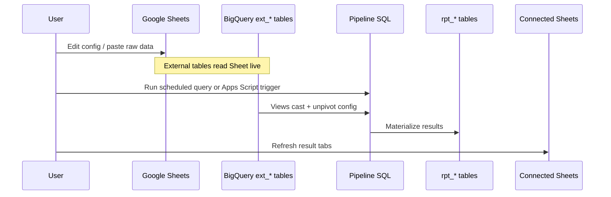

# Google Sheets ↔ BigQuery Integration

## Workbook structure (recommended tabs)

Organise one **Bonus Calc** Google Sheet (or linked workbooks) with clear tab groups:

### A. Control

| Tab | → BigQuery | Notes |
|-----|------------|-------|
| **Cycle** | `ctl_cycle` | cycle_month, date cutoffs, include/exclude countries |
| **Exchange Info** | `cfg_exchange_rate` | ZAR rates per country |

### B. Config (human-editable)

| Tab | → BigQuery | Notes |
|-----|------------|-------|
| **Bonus Criteria** | `cfg_policy_key`, `cfg_manager_kpi_weight`, `cfg_store_bonus_weight`, `cfg_position_bonus_potential`, `cfg_overrider_tier` | Your wide Managers criteria layout is fine; sync unpivots |
| **Store Staff Criteria** | `cfg_kpi_threshold` (oil shrink sizes, etc.) | If separate from Bonus Criteria |
| **Parameters** | `cfg_global_parameter` | Floors, gates, cluster % |
| **Cluster Manager** | `dim_cluster_manager_assignment` | employee, home store, managed stores |
| **Store Master** | `dim_store` | Must include `policy_key` column |

### C. Raw data (paste or IMPORTRANGE each cycle)

| Tab | → BigQuery |
|-----|------------|
| **Labour Clocking** | `stg_labour_clocking` | **Primary fact table** — from shared file |
| Sales, Sales Target, Employees info | `stg_sales`, etc. | See schemas-and-pipeline.md staging list |
| KPI feeds | respective `stg_*` | Oil shrink, Labour, Banking, … |

### D. Results (Connected Sheets — read only)

| Tab | ← BigQuery | Do not edit formulas |
|-----|------------|----------------------|
| **Calculations** | `rpt_calculation_table` | Detail + cluster rows at bottom |
| **Payout Per Person** | `rpt_payout_per_person` | |
| **Store Bonus Summary** | `rpt_store_bonus_summary` | |
| **Manager Bonus Summary** | `rpt_manager_bonus_summary` | |

Use **Data → Connected Sheets** (or BigQuery connector) pointing at result tables. Refresh after each pipeline run.

---

## Sync pattern (recommended)

### Option A — External tables (recommended for inputs)

One **`ext_*` external table** per Sheet tab (`format = GOOGLE_SHEETS`). Pipeline reads **views** that cast types and unpivot wide config.

- No Apps Script copy step for inputs
- Sheet must be shared with BigQuery’s Drive access identity
- See **[external-tables-sheets.md](external-tables-sheets.md)** and **`sql/00_ddl/ext_sheets/`**

### Option B — Apps Script batch load (fallback)

Load into native `stg_*` if external reads are too slow or schema changes often.

### Results (outputs)

**Connected Sheets only** — point result tabs at native `rpt_*` tables. Not external tables.

---

## Monthly checklist

### Early run (non-Angola, ~before 10th)

- [ ] Set `cycle_month` on **Cycle** tab
- [ ] Set `exclude_countries` = `Angola` (or `include_countries` = all others)
- [ ] Refresh **Labour Clocking** from shared file
- [ ] Paste/update sales, targets, KPI raw tabs
- [ ] Review **Bonus Criteria** / Store Master `policy_key`
- [ ] Run sync + pipeline
- [ ] Spot-check 2–3 employees and 2 stores against expectations
- [ ] Refresh Connected result tabs

### Late run (Angola)

- [ ] Update Angola-specific raw tabs when ready
- [ ] Clear exclude filter or set `include_countries` = `Angola`
- [ ] Re-run pipeline (merge replaces Angola rows for same `cycle_month`)
- [ ] Refresh results

### After sign-off

- [ ] Download Google Sheet (File → Download) as backup
- [ ] Optional: export result tabs to CSV for finance

---

## Apps Script scope (light glue only)

Keep in `apps-script/` (to be added):

| Function | Purpose |
|----------|---------|
| `syncAllStaging()` | Sheet → BigQuery staging |
| `runPipeline()` | Calls BigQuery scheduled query with cycle params |
| `refreshResults()` | Prompt user to refresh Connected Sheets |
| `setCycleAngolaExcluded()` / `setCycleAngolaIncluded()` | Convenience for country filter |

**Do not** implement bonus math in Apps Script.

---

## IAM / access (handoff notes)

Document in your internal runbook (outside this repo if sensitive):

- GCP project id
- BigQuery dataset name
- Service account used by Apps Script
- Who can edit config Sheet vs view results

---

## Related files in repo

- [design.md](design.md) — architecture
- [schemas-and-pipeline.md](schemas-and-pipeline.md) — table DDL and step order
- [graphify.md](graphify.md) — project knowledge graph for maintainers
- [bonus-model-logic.md](bonus-model-logic.md) — legacy formula behaviour reference

SQL DDL files will live under `sql/` as the pipeline is implemented.
